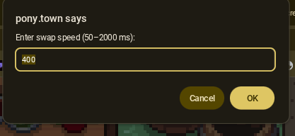

# Pony-Town-Swapper
A tool to quickly change between saved ponies on Pony Town!

## How to use
Download or copy the script [main.js](https://github.com/Nikowoo/Pony-Town-Swapper/blob/main/main.js) and paste it into your browsers developer console   ***OR*** Make a new userscript with the userscript manager of your choice.
 (eg: Tampermonkey on [Desktop](https://chromewebstore.google.com/detail/tampermonkey/dhdgffkkebhmkfjojejmpbldmpobfkfo) & [IOS](https://apps.apple.com/us/app/tampermonkey/id6738342400))

### On Desktop
Press the period key `"."` to bring up the change speed popup.
 
Then press comma `","` to toggle the swapping on & off

 

### On Mobile
Press the screen with `4` fingers to bring up the change speed popup 
 
Then tap the screen with `3` fingers to toggle the script on & off
